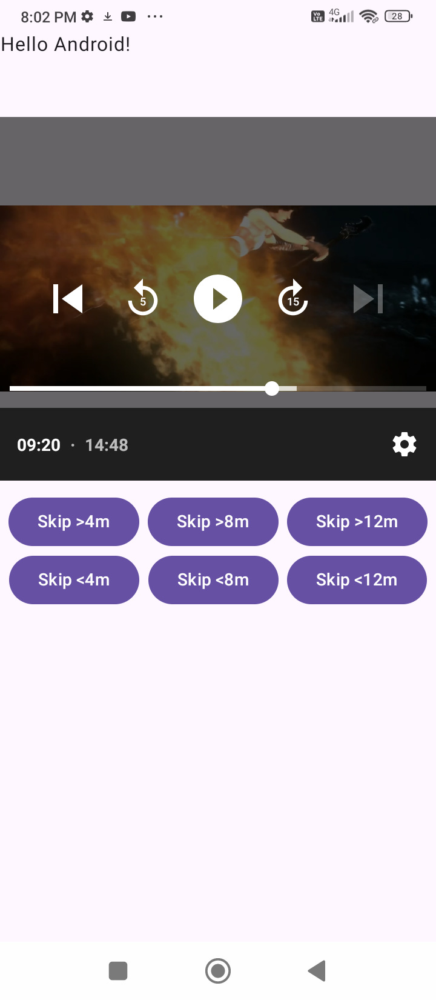
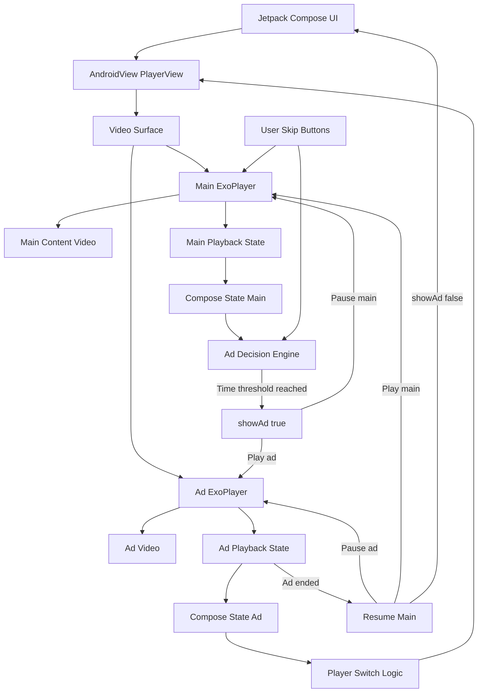
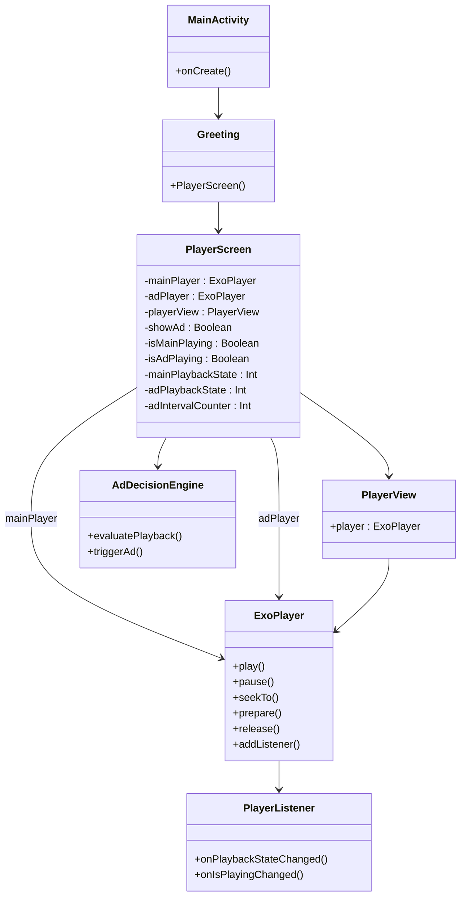
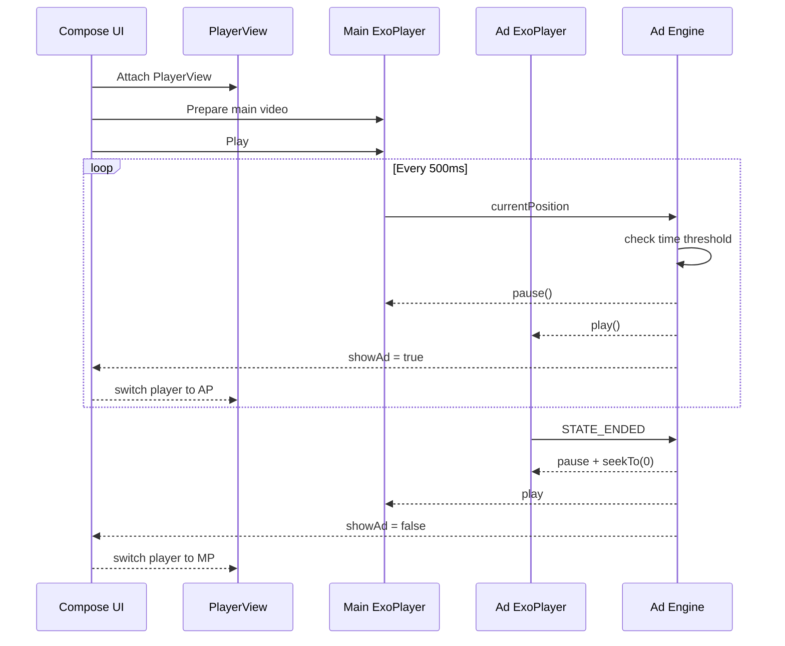

# README

## Contents
1. [Screenshot][#screenshot]
2. [HLD][#HLD]
3. [LLD Component Class Diagram][#LLD — Component Class Diagram]
4. [LLD Playback Control Flow][#LLD — Playback Control Flow]

### Screenshot

### HLD

### LLD — Component Class Diagram 

### LLD — Playback Control Flow

