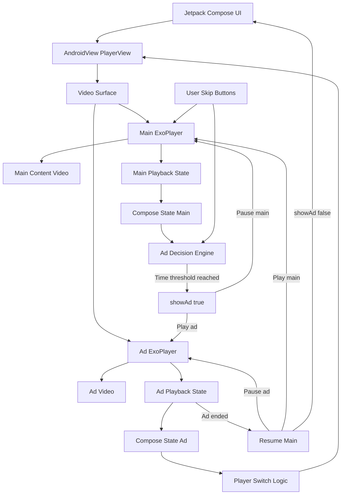

# README

```mermaid
flowchart TD

UI[Jetpack Compose UI]
UI --> AV[AndroidView PlayerView]

AV --> Surface[Video Surface]

Surface --> MP[Main ExoPlayer]
Surface --> AP[Ad ExoPlayer]

MP --> MC[Main Content Video]
AP --> AD[Ad Video]

MP --> MS[Main Playback State]
AP --> AS[Ad Playback State]

MS --> CS[Compose State Main]
AS --> CS2[Compose State Ad]

CS --> AE[Ad Decision Engine]
AE -->|Time threshold reached| ShowAd[showAd true]
ShowAd -->|Pause main| MP
ShowAd -->|Play ad| AP

AS -->|Ad ended| Resume[Resume Main]
Resume -->|Pause ad| AP
Resume -->|Play main| MP
Resume -->|showAd false| UI

CS2 --> Switch[Player Switch Logic]
Switch --> AV

Buttons[User Skip Buttons] --> MP
Buttons --> AE

```
